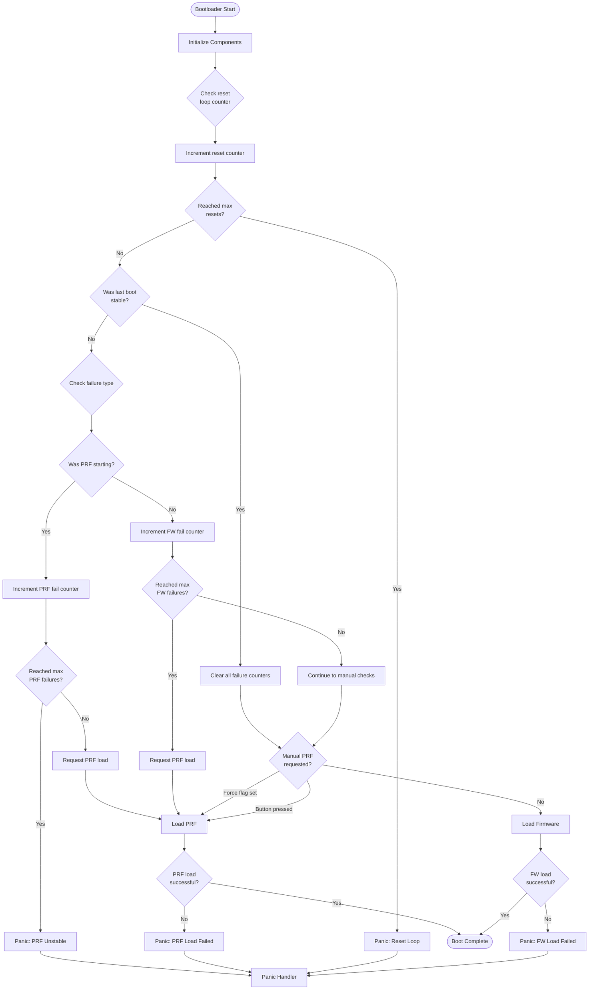

# PebbleOS bootloader

<a href="https://github.com/coredevices/pblboot/actions/workflows/build.yml?query=branch%3Amain">
  
</a>

This repository contains the PebbleOS bootloader.

## Getting Started

Before getting started, make sure you have a proper Zephyr development
environment. Follow the official
[Zephyr Getting Started Guide](https://docs.zephyrproject.org/latest/getting_started/index.html).

### Initialization

The first step is to initialize the workspace folder where `pblboot` and all
Zephyr modules will be cloned. Run the following command:

```shell
west init -m git@github.com:coredevices/pblboot --mr main pblboot
cd pblboot
west update
```

### Building and running

To build the bootloader, run the following command:

```shell
cd pblboot
west build -b $BOARD boot
```

where `$BOARD` is the target board, e.g. `pt2`.

Once you have built the bootloader, run the following command to flash it:

```shell
west flash
```

## Bootloader Design

The bootloader implements a robust boot sequence with failure recovery
mechanisms. The workflow handles firmware stability tracking, Pebble Recovery
Firmware (PRF) loading, and reset loop detection.

### Key Components

#### Retained Memory for State Tracking

The bootloader uses retained bootbit flags to track state across resets. The
implementation is platform-dependent.

#### Stability Tracking

The bootloader maintains counters to track firmware or PRF failures and the
number of consecutive resets:

- **Firmware Strikes**: Counts consecutive firmware boot failures
- **PRF Strikes**: Counts consecutive PRF boot failures
- **Reset Counter**: Counts consecutive resets

When firmware or PRF boots successfully, the reset counter is cleared.
Similarly, a stable flag is set after firmware or PRF has been running for a
while, so that the bootloader can reset the boot failure counters on the next
reboot.

#### PRF Loading

PRF can be triggered in several scenarios:

- **Automatic**: After reaching the maximum number of firmware failures
- **Manual**: Via button press during boot (Back+Up+Center for
  `CONFIG_PB_PRF_BUTTON_COMBO_TIME_MS`)
- **Forced**: Through bootbit flags (requested by firmware)
- **Recovery**: When PRF itself fails but hasn't reached the maximum number of
  failures

#### Failure Handling

The bootloader will panic in the event of failure. Except for early
initialization failures, any key press will reboot the system so the boot
sequence is executed again.

### Firmware Loading

The bootloader implements a dual slot firmware system for safe updates, with
a fallback to PRF. The current implementation relies on code being executable in
place, so no data copying is performed by the bootloader.

#### Image Header Format

Each firmware image begins with a structured header:

```c
struct firmware_header {
    uint32_t magic;         // Magic number (0x96f3b83d)
    uint32_t header_length; // Size of header structure
    uint64_t timestamp;     // Build timestamp for version comparison
    uint32_t start_offset;  // Offset to actual firmware code
    uint32_t length;        // Firmware binary size
    uint32_t crc;           // CRC32-IEEE checksum
}
```

#### Slot Selection Algorithm

The bootloader validates both slots and selects firmware based on:

1. **Validation**: Each slot is checked for:
   - Valid magic number and header structure
   - CRC32-IEEE checksum verification of the entire firmware image

2. **Selection Priority**:
   - If both slots are valid: Boot the slot with the newer timestamp
   - If only one slot is valid: Boot the valid slot
   - If no slots are valid: Attempt to load PRF

### Boot Sequence Overview


